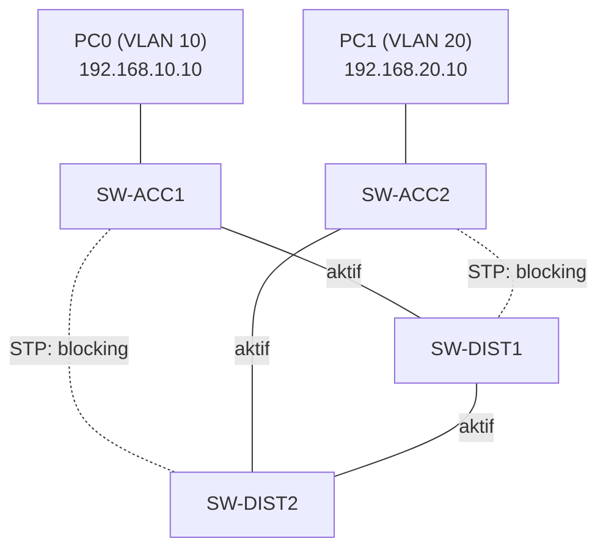

# Redundant Kampüs Ağı — Packet Tracer Lab

`Packet Tracer` `2-Tier / Collapsed Core` `VLAN + InterVLAN Routing`

CCNA çalışmaları kapsamında 2-tier ve 3-tier network tasarımını Packet Tracer üzerinde uygulamalı olarak kurdum. Amaç, tek noktadan çökebilen düz bir tasarım yerine, hiyerarşik ve redundant bir yapı kurup uçtan uca çalıştığını doğrulamaktı: VLAN'larla segmentlenmiş, tek switch veya tek kablo arızasında tüm ağın çökmediği küçük bir kampüs ağı.

## Topoloji

4 switch: 2 access, 2 distribution (distribution katmanı multilayer, yani routing yapabiliyor). Her access switch, her iki distribution switch'e de bağlı (dual-homing) — tek bir uplink (alt katmandaki bir cihazın üst katmandaki cihaza giden bağlantısı) veya switch arızası ağı bölmesin diye.



5 fiziksel link var, aktif olan 3 tanesi. Kalan 2'si STP (Spanning Tree Protocol — switch'ler arasında fiziksel döngü varsa broadcast storm oluşmasını engellemek için bazı portları otomatik olarak devre dışı bırakan, döngüsüz mantıksal bir ağaç yapısı kuran Layer 2 protokolü) tarafından döngü oluşmasın diye "blocking" durumunda tutuluyor. 4 switch için döngüsüz bir ağaç kurmaya N-1 = 3 aktif link yeterli; blocking'teki linkler yedek olarak bekliyor ve aktif bir link koptuğunda STP birkaç saniye içinde bunlardan birini forwarding'e alıyor.

## IP / VLAN planı

| Cihaz | Rol | VLAN | IP |
|---|---|---|---|
| SW-ACC1 | Access | trunk (10, 20) | — |
| SW-ACC2 | Access | trunk (10, 20) | — |
| SW-DIST1 | Distribution (routing) | SVI 10 + 20 | 192.168.10.1 / 192.168.20.1 |
| SW-DIST2 | Distribution | trunk (10, 20) | — (henüz SVI yok, ilgili notu aşağıda) |
| PC0 | Son kullanıcı | 10 | 192.168.10.10 /24, GW 192.168.10.1 |
| PC1 | Son kullanıcı | 20 | 192.168.20.10 /24, GW 192.168.20.1 |

VLAN 10 "SALES", VLAN 20 "IT" olarak adlandırıldı (lab amaçlı örnek isimlendirme).

## Kurulum adımları

### 1. Hostname'ler

```
enable
configure terminal
hostname SW-ACC1
```

(Aynı işlem SW-ACC2, SW-DIST1, SW-DIST2 için tekrarlandı.)

### 2. VLAN'lar

VLAN'lar dört switch'in her birinde ayrı ayrı tanımlandı. VTP (VLAN Trunking Protocol — VLAN veritabanını switch'ler arasında trunk üzerinden otomatik senkronize eden, Cisco'ya özgü protokol) kullanılmadığı için switch'ler VLAN veritabanını birbirinden öğrenmiyor; her switch kendi lokal VLAN veritabanını tutuyor.

```
vlan 10
name SALES
exit
vlan 20
name IT
exit
```

### 3. Trunk portları

Switch'ler arası bağlantılar (access-distribution ve distribution-distribution) trunk olarak yapılandırıldı — trunk, birden fazla VLAN'ın tek bir fiziksel kablo üzerinden taşınmasını sağlayan port modu; frame'lere hangi VLAN'a ait olduğunu belirten bir etiket (802.1Q tag) eklenir:

```
interface range fastEthernet0/1 - 3
switchport trunk encapsulation dot1q
switchport mode trunk
```

Not: `encapsulation dot1q` satırı yalnızca distribution katmanındaki (3560 model) switch'lerde gerekti, çünkü bu modeller hem eski Cisco'ya özel ISL hem de endüstri standardı 802.1Q trunking yöntemini destekliyor ve hangisinin kullanılacağı açıkça belirtilmeli. Access katmanındaki 2960'lar yalnızca 802.1Q'yu desteklediği için bu satıra ihtiyaç duymadı.

Doğrulama (SW-DIST2 üzerinden gerçek çıktı):

```
SW-DIST2#show interfaces trunk

Port      Mode         Encapsulation  Status        Native vlan
Fa0/1     on           802.1q         trunking      1
Fa0/2     on           802.1q         trunking      1
Fa0/3     on           802.1q         trunking      1

Port      Vlans allowed and active in management domain
Fa0/1     1,10,20
Fa0/2     1,10,20
Fa0/3     1,10,20
```

### 4. Access portları

PC'lerin bağlı olduğu portlar ilgili VLAN'a atandı (access switch'lerde) — access portu, tek bir VLAN'a ait uç cihazların bağlandığı, trafiği untagged taşıyan port türüdür:

```
interface fastEthernet0/3
switchport mode access
switchport access vlan 10
```

Doğrulama: `show vlan brief`.

### 5. InterVLAN routing

VLAN 10 ile VLAN 20 birbirinden izole; aralarında trafik geçebilmesi için routing gerekiyor. Bunun için her VLAN'a bir SVI (Switch Virtual Interface — multilayer switch üzerinde bir VLAN için tanımlanan sanal Layer 3 arayüz) tanımlanıp IP adresi atanıyor; bu IP, o VLAN'daki cihazlar için gateway görevi görüyor. Bu şu an için yalnızca SW-DIST1 üzerinde yapılandırıldı:

```
ip routing
interface vlan 10
ip address 192.168.10.1 255.255.255.0
no shutdown
exit
interface vlan 20
ip address 192.168.20.1 255.255.255.0
no shutdown
```

`ip routing` global komutu açılmadan multilayer switch olsa dahi VLAN'lar arası paket geçişi gerçekleşmiyor.

SW-DIST2'de şu an SVI yok — bir sonraki adımda HSRP ile gateway yedekliliği kurulacak (bkz. "Sırada ne var").

### 6. PC IP ayarları

PC0 ve PC1'e Desktop > IP Configuration üzerinden statik IP, subnet mask ve gateway (SW-DIST1'in ilgili SVI'ı) girildi.

## Ping testi

PC0'dan PC1'e ping başarılı. Güncel STP topolojisine göre (yukarıdaki diyagram) paketin izlediği yol:

```
PC0 → SW-ACC1 → SW-DIST1 → SW-DIST2 → SW-ACC2 → PC1
```

SW-ACC1'in SW-DIST1'e giden linki aktif olduğu için paket doğrudan SW-DIST1'e ulaşıyor; VLAN 10 → VLAN 20 çevirisi (Layer 3 routing) burada yapılıyor. SW-DIST2'de henüz routing yapılandırılmadığı için oradan geçiş yalnızca Layer 2 iletim; paket SW-ACC2'nin aktif uplink'i olan SW-DIST2 üzerinden SW-ACC2'ye iniyor. Dönüş paketi (echo reply) aynı yolu ters yönde izliyor — ICMP simetrik bir yol izlediği için beklenen davranış bu.

Bu, STP'nin belirlediği aktif topolojinin, iki nokta arası "mantıken en kısa yol" ile her zaman örtüşmediğini gösteren somut bir örnek.

## Sırada ne var

- **HSRP**: Şu an tek routing noktası SW-DIST1. SW-DIST2'ye de SVI eklenip HSRP ile iki distribution switch'in tek sanal gateway gibi çalışması sağlanacak.
- **3-Tier'e geçiş**: Bir Core katmanı eklenerek tasarımın 3-tier'e genişletilmesi planlanıyor.
- Ekran görüntüleri ve `.pkt` dosyası bu repoya eklenecek.
