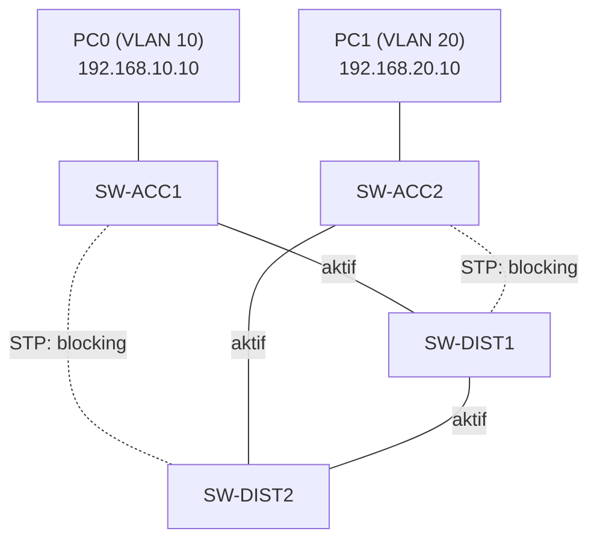

# Redundant Kampüs Ağı — Packet Tracer Lab

`Packet Tracer` `2-Tier / Collapsed Core` `VLAN + InterVLAN Routing`

CCNA çalışmaları kapsamında 2-tier ve 3-tier network tasarımını Packet Tracer üzerinde uygulamalı olarak kurdum. Amaç, tek noktadan çökebilen düz bir tasarım yerine, hiyerarşik ve redundant bir yapı kurup uçtan uca çalıştığını doğrulamaktı. Yani: VLAN'larla bölünmüş, tek bir switch veya tek bir kablo arızasında tüm ağın çökmediği küçük bir kampüs ağı.

## Topoloji

4 switch var: 2 tanesi access katmanında, 2 tanesi distribution katmanında. Distribution katmanındaki switch'ler "multilayer" — yani normal switch'lerden farklı olarak routing (Layer 3 iş) de yapabiliyorlar.

Her access switch, her iki distribution switch'e de bağlı. Buna "dual-homing" deniyor: tek bir uplink (alt katmandaki bir cihazın üst katmandaki cihaza giden bağlantısı) veya tek bir switch arızası, ağın geri kalanını etkilemesin diye bilerek iki yol bırakılıyor.



Toplamda 5 fiziksel kablo var ama aktif olarak kullanılan sadece 3 tanesi. Kalan 2'si STP (Spanning Tree Protocol) tarafından "blocking" durumunda tutuluyor.

STP kısaca şunu yapıyor: switch'ler arasında birden fazla yol (yani fiziksel bir döngü) varsa, bu döngü bir paketin ağda sonsuza kadar dönüp durmasına (broadcast storm) yol açabilir. STP bunu önlemek için fazla olan yolları otomatik olarak kapatıyor, geri kalanları da yedek olarak bekletiyor. Aktif bir kablo koparsa, STP birkaç saniye içinde bekleyen yedek yollardan birini devreye sokuyor.

Buradaki sayı da mantıklı: 4 switch'i döngüsüz şekilde birbirine bağlamak için sadece 3 aktif bağlantı yeterli (matematikte buna N-1 kuralı denir, N = switch sayısı). Elimizde 5 kablo olduğu için STP otomatik olarak 2 tanesini blocking'e alıyor.

## IP / VLAN planı

| Cihaz | Rol | VLAN | IP |
|---|---|---|---|
| SW-ACC1 | Access | trunk (10, 20) | — |
| SW-ACC2 | Access | trunk (10, 20) | — |
| SW-DIST1 | Distribution (routing) | SVI 10 + 20 | 192.168.10.1 / 192.168.20.1 |
| SW-DIST2 | Distribution | trunk (10, 20) | — (henüz SVI yok, ilgili not aşağıda) |
| PC0 | Son kullanıcı | 10 | 192.168.10.10 /24, GW 192.168.10.1 |
| PC1 | Son kullanıcı | 20 | 192.168.20.10 /24, GW 192.168.20.1 |

VLAN 10 "SALES", VLAN 20 "IT" olarak adlandırıldı (lab amaçlı örnek isimlendirme, gerçek bir departman ayrımı yok).

## Kurulum adımları

### 1. Hostname'ler

Dört switch de birbirinden ayırt edilebilsin diye önce isimlendirildi:

```
enable
configure terminal
hostname SW-ACC1
```

(Aynı işlem SW-ACC2, SW-DIST1, SW-DIST2 için tekrarlandı.)

### 2. VLAN'lar

Önce VLAN'ın ne olduğu: VLAN (Virtual LAN), fiziksel olarak aynı switch'e bağlı olsalar bile cihazları mantıksal olarak ayrı ağlara bölme yöntemi. VLAN 10'daki bir PC ile VLAN 20'deki bir PC aynı switch'e, hatta aynı kabloya bile bağlı olsa birbirini normalde hiç göremiyor — sanki fiziksel olarak ayrı iki switch'e bağlıymış gibi davranıyorlar. Bu lab'da PC0'ı VLAN 10'a, PC1'i VLAN 20'ye koymamızın sebebi tam olarak bu: onları mantıksal olarak birbirinden ayırmak, sonra da (aşağıdaki InterVLAN routing adımında) kontrollü şekilde tekrar konuşturmak.

VLAN'lar dört switch'in her birinde ayrı ayrı tanımlandı — tek bir switch'te yapıp diğerlerine otomatik yayılmasını beklemedik. Sebebi: VTP (VLAN Trunking Protocol) kullanılmadı. VTP, normalde VLAN listesini switch'ler arasında otomatik senkronize eden Cisco'ya özgü bir protokol. Bu lab'da kapalı olduğu için her switch kendi VLAN listesini kendi hafızasında ayrı ayrı tutuyor; bu yüzden aynı komutlar dört switch'e de tek tek girildi.

```
vlan 10
name SALES
exit
vlan 20
name IT
exit
```

### 3. Trunk portları

Switch'ler arası bağlantılar (access-distribution ve distribution-distribution) trunk olarak yapılandırıldı. Trunk, birden fazla VLAN'ın aynı anda tek bir fiziksel kablo üzerinden taşınabilmesini sağlayan bir port modu. Bunu şöyle düşünebilirsin: normal (access) bir port tek bir VLAN'ın trafiğini taşıyabilir, ama trunk portu birden fazla VLAN'ı aynı kablodan geçirebiliyor — her paketin hangi VLAN'a ait olduğunu anlamak için üzerine küçük bir "etiket" (802.1Q tag) ekleniyor.

```
interface range fastEthernet0/1 - 3
switchport trunk encapsulation dot1q
switchport mode trunk
```

Satır satır ne yapıyor:
- `interface range fastEthernet0/1 - 3` — Fa0/1, Fa0/2 ve Fa0/3 portlarını tek seferde seçiyor; böylece aynı ayarları üç kez tek tek yazmak yerine hepsine birden uyguluyoruz.
- `switchport trunk encapsulation dot1q` — seçili portlar trunk moduna geçtiğinde hangi etiketleme yöntemini (802.1Q) kullanacağını belirtiyor.
- `switchport mode trunk` — portları asıl trunk moduna geçiren satır bu. Bir port fabrika ayarında access moddadır (tek VLAN taşır), bu komut onu trunk'a çeviriyor.

Not: `encapsulation dot1q` satırı yalnızca distribution katmanındaki (3560 model) switch'lerde gerekti. Sebebi, bu switch modelinin iki farklı trunk yöntemini (eski Cisco'ya özel ISL ve endüstri standardı 802.1Q) desteklemesi — iki seçenek olunca switch'e hangisini kullanacağını açıkça söylemek gerekiyor. Access katmanındaki 2960 switch'ler ise sadece 802.1Q'yu bildiği için, tek seçenek olduğundan bu satıra hiç ihtiyaç duymadı.

Doğrulama (SW-DIST2 üzerinden gerçek çıktı):

```
SW-DIST2#show interfaces trunk

Port      Mode         Encapsulation  Status        Native vlan
Fa0/1     on           802.1q         trunking      1
Fa0/2     on           802.1q         trunking      1
Fa0/3     on           802.1q         trunking      1

Port      Vlans allowed and active in management domain
Fa0/1     1,10,20
Fa0/2     1,10,20
Fa0/3     1,10,20
```

### 4. Access portları

PC'lerin bağlı olduğu portlar ilgili VLAN'a atandı (access switch'lerde). Access portu, trunk'ın tersine, sadece tek bir VLAN'a ait uç cihazların (PC, yazıcı vb.) bağlandığı port türü — trafik burada "etiketsiz" (untagged) taşınıyor, çünkü bir tarafta zaten tek VLAN olduğu için ekstra bir işaretlemeye gerek yok.

```
interface fastEthernet0/3
switchport mode access
switchport access vlan 10
```

Satır satır:
- `interface fastEthernet0/3` — PC'nin bağlı olduğu portu seçiyoruz.
- `switchport mode access` — portu access moduna alıyoruz; trunk'ın tersine bu port yalnızca tek bir VLAN'ın trafiğini taşıyacak.
- `switchport access vlan 10` — bu portu VLAN 10'un üyesi yapıyoruz. Artık bu porta bağlanan her cihaz otomatik olarak VLAN 10'un içinde sayılıyor.

Doğrulama: `show vlan brief`.

### 5. InterVLAN routing

VLAN 10 ile VLAN 20 birbirinden tamamen izole; yani normalde aralarında hiç trafik geçmiyor. Aralarında konuşabilmeleri için bir yerde routing (Layer 3 iş) yapılması gerekiyor.

Bunun için her VLAN'a bir SVI tanımlanıp IP adresi verildi. SVI (Switch Virtual Interface), bir multilayer switch üzerinde belirli bir VLAN için tanımlanan sanal bir arayüz — fiziksel bir port değil, yazılımsal olarak var olan bir arayüz. Bu arayüze IP adresi verilince, o VLAN'daki cihazlar için "gateway" (varsayılan ağ geçidi) görevi görmeye başlıyor. Şu an bu sadece SW-DIST1 üzerinde yapılandırıldı:

```
ip routing
interface vlan 10
ip address 192.168.10.1 255.255.255.0
no shutdown
exit
interface vlan 20
ip address 192.168.20.1 255.255.255.0
no shutdown
```

Satır satır:
- `ip routing` — switch'e VLAN'lar arasında paket yönlendirebilme iznini global olarak (bir kere, tüm cihaz için) açıyor. Bu olmadan aşağıdaki SVI'lar tanımlansa bile routing çalışmıyor.
- `interface vlan 10` — VLAN 10 için sanal bir arayüz (SVI) oluşturup onun ayarlarına giriyoruz. Bu fiziksel bir port değil, yazılımsal bir arayüz.
- `ip address 192.168.10.1 255.255.255.0` — bu sanal arayüze bir IP adresi ve subnet mask veriyoruz. Bu IP, VLAN 10'daki tüm cihazların gateway'i (varsayılan ağ geçidi) olacak.
- `no shutdown` — arayüzler Cisco cihazlarında fabrika ayarında kapalı gelir; bu satır arayüzü aktif hale getiriyor.
- `exit` — VLAN 10'un arayüz ayarlarından çıkıp aynı üç işlemi (arayüze gir, IP ver, aç) VLAN 20 için tekrarlıyoruz.

Özetle `ip routing` komutu, switch'e "VLAN'lar arasında da paket yönlendir" demenin global anahtarı. Bu komut açılmadan, switch multilayer olsa bile VLAN'lar arası paket geçişi gerçekleşmiyor.

SW-DIST2'de şu an bilerek SVI yok — bir sonraki adımda HSRP ile gateway yedekliliği kurulacak (bkz. "Sırada ne var").

### 6. PC IP ayarları

PC0 ve PC1'e Desktop > IP Configuration üzerinden statik IP, subnet mask ve gateway (SW-DIST1'in ilgili SVI'ı) girildi.

## Ping testi

PC0'dan PC1'e ping başarılı. Güncel STP topolojisine göre (yukarıdaki diyagram) paketin izlediği yol:

```
PC0 → SW-ACC1 → SW-DIST1 → SW-DIST2 → SW-ACC2 → PC1
```

Neden bu yoldan gittiğini adım adım açıklamak gerekirse: SW-ACC1'in SW-DIST1'e giden bağlantısı aktif olduğu için paket doğrudan SW-DIST1'e ulaşıyor. VLAN 10 → VLAN 20 çevirisi (yani asıl routing işlemi) tam burada, SW-DIST1'de yapılıyor. Sonra paket SW-DIST2 üzerinden SW-ACC2'ye iniyor — çünkü SW-ACC2'nin aktif bağlantısı SW-DIST1'e değil, SW-DIST2'ye. SW-DIST2 burada routing yapmıyor, sadece paketi olduğu gibi iletiyor (Layer 2 iş). Dönüş paketi (echo reply) de aynı yolu ters yönde izliyor — bu ICMP'nin normal, beklenen davranışı.

Kısacası: iki nokta arasındaki "mantıken en kısa yol" ile STP'nin gerçekte açık bıraktığı yol her zaman aynı olmuyor. Hangi kablonun aktif, hangisinin bloklu olduğu, paketin fiilen hangi switch'lerden geçeceğini belirliyor.

## Sırada ne var

- **HSRP**: Şu an tek routing noktası SW-DIST1. O switch giderse VLAN'lar arası trafik de durur. SW-DIST2'ye de SVI eklenip HSRP ile iki distribution switch'in tek bir "sanal gateway" gibi çalışması sağlanacak.
- **3-Tier'e geçiş**: Bir Core katmanı eklenerek tasarım 3-tier'e genişletilecek.
- Ekran görüntüleri ve `.pkt` dosyası bu repoya eklenecek.
