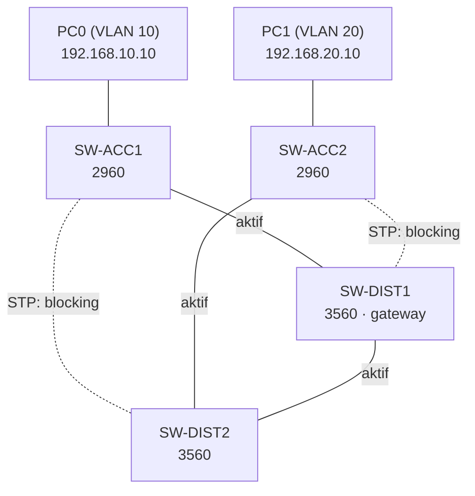

# Redundant Kampüs Ağı — Packet Tracer Lab

`Packet Tracer` `2-Tier / Collapsed Core` `VLAN` `802.1Q Trunk` `STP` `Inter-VLAN Routing (SVI)`

CCNA çalışmaları sırasında Packet Tracer'da kurduğum, tek bir switch veya kablo arızasında çökmeyecek şekilde tasarlanmış 2-tier (collapsed core) bir kampüs ağı. İki VLAN, dual-homed access switch'ler ve distribution katmanında SVI ile inter-VLAN routing içeriyor.

En öğretici kısmı, ağı kurmak değil, kurduktan sonra **paketin gerçekte hangi yoldan gittiğini** incelemek oldu (bkz. [Öğrendiklerim](#öğrendiklerim)).

## Topoloji



- **4 switch:** 2 access (2960), 2 distribution (3560, multilayer).
- **Dual-homing:** Her access switch iki distribution switch'e de bağlı; tek bir uplink veya distribution switch arızası erişimi kesmesin diye.
- **STP:** 5 fiziksel bağlantıdan 3'ü aktif, 2'si blocking. 4 switch'i döngüsüz bağlamak için N−1 = 3 bağlantı yeterli; fazlası yedekte bekliyor.

## Tasarım kararları

| Karar | Neden |
|---|---|
| 2-tier (collapsed core) | Küçük bir kampüs için ayrı bir core katmanı gereksiz; distribution switch'ler core görevini de üstleniyor. |
| Her access switch'e iki uplink | Tek bağlantı veya tek distribution switch arızasında erişim devam etsin. |
| Inter-VLAN routing distribution'da SVI ile | Multilayer switch routing'i kendisi yapabiliyor; ayrı bir router'a (router-on-a-stick) gerek yok. |
| SVI şimdilik sadece SW-DIST1'de | SW-DIST2'ye gateway, HSRP ile birlikte eklenecek; iki bağımsız gateway yerine tek bir sanal gateway olsun diye. |
| VTP kullanılmadı | VLAN'lar her switch'te ayrı ayrı tanımlandı. |

## IP / VLAN planı

| Cihaz | Rol | VLAN | IP |
|---|---|---|---|
| SW-ACC1 | Access | trunk (10, 20) | — |
| SW-ACC2 | Access | trunk (10, 20) | — |
| SW-DIST1 | Distribution + gateway | SVI 10, SVI 20 | 192.168.10.1 / 192.168.20.1 |
| SW-DIST2 | Distribution | trunk (10, 20) | — |
| PC0 | Son kullanıcı | 10 (SALES) | 192.168.10.10/24, GW 192.168.10.1 |
| PC1 | Son kullanıcı | 20 (IT) | 192.168.20.10/24, GW 192.168.20.1 |

## Yapılandırma

**VLAN'lar** (dört switch'te de):
```
vlan 10
 name SALES
vlan 20
 name IT
```

**Trunk'lar** (switch'ler arası bağlantılar):
```
interface range fastEthernet0/1 - 3
 switchport trunk encapsulation dot1q   ! sadece 3560'larda gerekli
 switchport mode trunk
```

**Access portları** (PC'lerin bağlı olduğu portlar):
```
interface fastEthernet0/3
 switchport mode access
 switchport access vlan 10
```

**Inter-VLAN routing** (SW-DIST1):
```
ip routing
interface vlan 10
 ip address 192.168.10.1 255.255.255.0
 no shutdown
interface vlan 20
 ip address 192.168.20.1 255.255.255.0
 no shutdown
```

## Doğrulama

**Trunk'lar** (SW-DIST2):
```
SW-DIST2#show interfaces trunk

Port      Mode         Encapsulation  Status        Native vlan
Fa0/1     on           802.1q         trunking      1
Fa0/2     on           802.1q         trunking      1
Fa0/3     on           802.1q         trunking      1

Port      Vlans allowed and active in management domain
Fa0/1     1,10,20
Fa0/2     1,10,20
Fa0/3     1,10,20
```

**Uçtan uca:** PC0 (VLAN 10) → PC1 (VLAN 20) ping başarılı. Paketin izlediği yol:

```
PC0 → SW-ACC1 → SW-DIST1 (routing: VLAN 10 → 20) → SW-DIST2 → SW-ACC2 → PC1
```

## Öğrendiklerim

### 1. Paketin yolunu kısa yol değil, STP belirliyor
SW-ACC2'nin SW-DIST1'e doğrudan bir kablosu var, ama STP o bağlantıyı bloklamış. Bu yüzden VLAN 20'nin trafiği gateway'e (SW-DIST1) ulaşmak için SW-DIST2 üzerinden dolaşıyor. Kâğıt üzerindeki en kısa yol ile STP'nin açık bıraktığı yol aynı olmayabiliyor.

### 2. Gateway ile STP root aynı switch'te olmalı
Yukarıdaki dolaşmanın asıl sebebi bir tasarım eksiği: STP root bridge'i ben seçmedim, switch'ler kendi aralarında (priority eşit olunca en düşük MAC adresine göre) seçti. Gateway SW-DIST1'deyken trafiğin her access switch'ten doğrudan SW-DIST1'e gitmesi için root bridge'in de SW-DIST1 olması gerekir:

```
SW-DIST1(config)# spanning-tree vlan 10,20 root primary
SW-DIST2(config)# spanning-tree vlan 10,20 root secondary
```

HSRP eklendiğinde aynı kural VLAN bazında geçerli: her VLAN için HSRP active router ile STP root aynı switch olmalı. Örneğin VLAN 10'da ikisi de SW-DIST1, VLAN 20'de ikisi de SW-DIST2 olursa hem yol düzgün olur hem de yük iki distribution switch'e dağılır.

### 3. `encapsulation dot1q` her switch'te gerekmiyor
3560'lar hem ISL'i hem 802.1Q'yu desteklediği için trunk'a geçmeden önce hangisinin kullanılacağı açıkça söylenmeli. 2960'lar sadece 802.1Q bildiği için bu satıra ihtiyaç duymuyor.

## Geliştirilebilecekler

- STP root'u gateway ile hizalamak ve `show spanning-tree` çıktılarıyla önce/sonra yolu belgelemek
- SW-DIST2'ye SVI ekleyip HSRP ile gateway yedekliliği kurmak
- Arıza testleri: aktif uplink'i kapatıp STP'nin yedek yolu açtığını ve kaç ping kaybedildiğini ölçmek
- `.pkt` dosyası ve ekran görüntüleri
